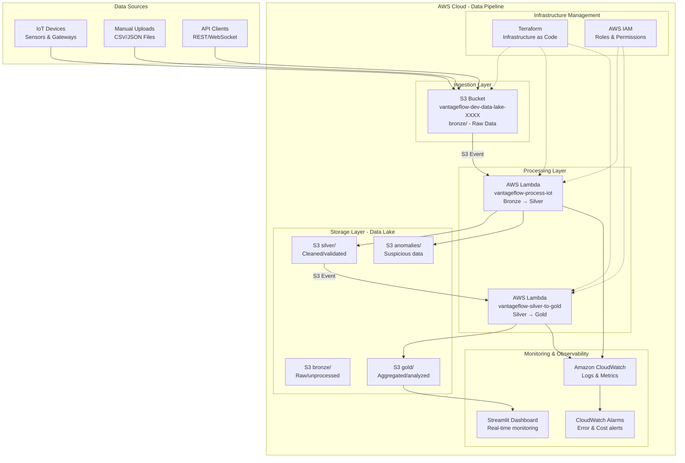
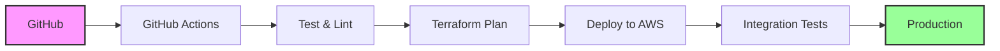

# 🏗️ VantageFlow Cloud AWS - System Architecture


-green)


## 📊 High-Level Architecture



## 🔄 Detailed Data Flow

### Phase 1: Data Ingestion (Bronze Layer)
```
┌─────────────────────────────────────────────────────────────┐
│                       BRONZE LAYER                          │
│                    (Raw/Unprocessed Data)                   │
├─────────────────────────────────────────────────────────────┤
│ Input Sources:                                              │
│  • IoT Devices → CSV files via AWS CLI/SDK                 │
│  • Manual uploads → aws s3 cp data.csv s3://bucket/bronze/ │
│  • API submissions → Future enhancement                     │
│                                                             │
│ Characteristics:                                            │
│  • Schema: timestamp,device_id,value,unit,anomaly_score    │
│  • Format: CSV (comma-separated values)                    │
│  • Retention: 30 days (configurable)                       │
│  • Size: ~4.5KB per 50-record batch                        │
└──────────────────────────────┬──────────────────────────────┘
                               │
                               ▼ S3 ObjectCreated Event
```

### Phase 2: Data Processing (Silver Layer)
```
┌─────────────────────────────────────────────────────────────┐
│                    SILVER LAYER PROCESSING                  │
│                  (Cleaning & Validation)                    │
├─────────────────────────────────────────────────────────────┤
│ AWS Lambda: vantageflow-process-iot                         │
│ Runtime: Python 3.11 | Memory: 512MB | Timeout: 60s        │
│                                                             │
│ Processing Steps:                                           │
│  1. Read CSV from S3 bronze/                               │
│  2. Validate schema & data types                           │
│  3. Apply business rules:                                  │
│     • anomaly_score > 0.5 → anomalies/                     │
│     • anomaly_score ≤ 0.5 → silver/                        │
│  4. Generate metrics: rows processed, anomalies found      │
│  5. Write cleaned data to S3 silver/                       │
│  6. Write anomalies to S3 anomalies/                       │
│                                                             │
│ Output Examples:                                            │
│  • silver/iot_batch_1_20251227_123150.csv                  │
│  • anomalies/iot_batch_1_20251227_123150.csv               │
└──────────────────────────────┬──────────────────────────────┘
                               │
                               ▼ S3 ObjectCreated Event
```

### Phase 3: Data Aggregation (Gold Layer)
```
┌─────────────────────────────────────────────────────────────┐
│                      GOLD LAYER PROCESSING                  │
│                  (Aggregation & Analytics)                  │
├─────────────────────────────────────────────────────────────┤
│ AWS Lambda: vantageflow-silver-to-gold                      │
│ Runtime: Python 3.11 | Memory: 512MB | Timeout: 120s       │
│                                                             │
│ Processing Steps:                                           │
│  1. Read CSV from S3 silver/                               │
│  2. Group by device_id                                     │
│  3. Calculate statistics per device:                       │
│     • total_readings (count)                               │
│     • avg_value (average)                                  │
│     • min_value (minimum)                                  │
│     • max_value (maximum)                                  │
│     • anomaly_count (anomaly_score > 0.5)                  │
│     • anomaly_percentage (% of anomalies)                  │
│  4. Write aggregated data to S3 gold/                      │
│                                                             │
│ Output Example:                                             │
│  device_id,total_readings,avg_value,min_value,max_value,   │
│  anomaly_count,anomaly_percentage                          │
│  FAB-TEM-001,15,28.5,22.0,35.0,2,13.3                      │
│  FAB-HUM-001,10,52.3,45.0,65.0,1,10.0                      │
└──────────────────────────────┬──────────────────────────────┘
                               │
                               ▼
                    [Ready for Analysis & Reporting]
```

## 🏛️ Infrastructure Components

### 1. **Storage Layer - Amazon S3**
```yaml
Bucket: vantageflow-dev-data-lake-21bcb50a
Structure:
  bronze/     # Raw incoming data (30-day retention)
  silver/     # Cleaned and validated data (60-day retention)  
  gold/       # Aggregated analytics data (90-day retention)
  anomalies/  # Suspicious/erroneous data (7-day retention)
  logs/       # Pipeline execution logs (7-day retention)

Features:
  • Versioning: Enabled for data recovery
  • Encryption: SSE-S3 (AES-256)
  • Lifecycle: Automated tiering to Glacier
  • Logging: Access logs to separate bucket
```

### 2. **Compute Layer - AWS Lambda**
```yaml
Function 1: vantageflow-process-iot
  Purpose: Bronze → Silver processing
  Trigger: S3 Event (s3:ObjectCreated in bronze/)
  Configuration:
    Runtime: python3.11
    Memory: 512MB
    Timeout: 60 seconds
    Environment:
      ANOMALY_THRESHOLD: "0.5"
      STAGE: "dev"

Function 2: vantageflow-silver-to-gold
  Purpose: Silver → Gold aggregation
  Trigger: S3 Event (s3:ObjectCreated in silver/)
  Configuration:
    Runtime: python3.11
    Memory: 512MB
    Timeout: 120 seconds
    Environment:
      LOG_LEVEL: "INFO"
      STAGE: "dev"
```

### 3. **Event-Driven Architecture**
```python
# S3 Event Notification Configuration
{
  "LambdaFunctionConfigurations": [
    {
      "Id": "bronze-trigger",
      "LambdaFunctionArn": "arn:aws:lambda:...:vantageflow-process-iot",
      "Events": ["s3:ObjectCreated:*"],
      "Filter": {
        "Key": {
          "FilterRules": [
            {"Name": "prefix", "Value": "bronze/"},
            {"Name": "suffix", "Value": ".csv"}
          ]
        }
      }
    },
    {
      "Id": "silver-trigger", 
      "LambdaFunctionArn": "arn:aws:lambda:...:vantageflow-silver-to-gold",
      "Events": ["s3:ObjectCreated:*"],
      "Filter": {
        "Key": {
          "FilterRules": [
            {"Name": "prefix", "Value": "silver/"},
            {"Name": "suffix", "Value": ".csv"}
          ]
        }
      }
    }
  ]
}
```

### 4. **Security & Access - AWS IAM**
```hcl
# IAM Role: vantageflow-lambda-role
Permissions:
  • s3:GetObject, PutObject, ListBucket (Data Lake bucket)
  • logs:CreateLogGroup, CreateLogStream, PutLogEvents (CloudWatch)
  • lambda:InvokeFunction (for future chaining)

Principle of Least Privilege:
  • Lambda can only read/write to specific S3 prefixes
  • No access to other AWS services
  • No administrative privileges
```

### 5. **Monitoring - Amazon CloudWatch**
```yaml
Log Groups:
  /aws/lambda/vantageflow-process-iot
  /aws/lambda/vantageflow-silver-to-gold

Metrics Collected:
  • Lambda: Invocations, Duration, Errors, Throttles
  • S3: Object counts, Storage size, Requests
  • Custom: Rows processed, Anomalies detected

Alarms Configured:
  • HighErrorRate: >5% errors in 5 minutes
  • HighDuration: >10 seconds average
  • CostExceeded: >$10 monthly estimate
```

## 📈 Scalability & Performance

### Horizontal Scaling
```
┌─────────────────────────────────────────────────────────────┐
│                    AUTO-SCALING BEHAVIOR                    │
├─────────────────────────────────────────────────────────────┤
│ Scenario: 100 files uploaded simultaneously                 │
│                                                             │
│ Lambda Response:                                            │
│  • Concurrent executions: Up to 1000 (default limit)       │
│  • Cold start: ~500ms (Python 3.11)                        │
│  • Warm containers: ~50ms subsequent invocations           │
│                                                             │
│ S3 Performance:                                             │
│  • Reads: 5500 GET requests/second (per prefix)           │
│  • Writes: 3500 PUT requests/second (per prefix)          │
│                                                             │
│ Estimated Processing Time:                                  │
│  • Bronze→Silver: 150ms per 1000 records                   │
│  • Silver→Gold: 120ms per 1000 records                     │
│  • Total pipeline: 270ms per 1000 records                  │
└─────────────────────────────────────────────────────────────┘
```

### Data Volume Capacity
| Metric | Current Capacity | Maximum Scale |
|--------|------------------|---------------|
| **File Size** | 10MB per CSV | 6GB (Lambda memory limit) |
| **Records/Second** | 10,000 | 100,000+ (with batching) |
| **Concurrent Files** | 100 | 1,000 (Lambda limit) |
| **Storage** | 5GB (Free Tier) | Unlimited (S3) |
| **Retention** | 90 days | Configurable (S3 lifecycle) |

## 🔒 Security Architecture

### Defense in Depth
```
┌─────────────────────────────────────────────────────────────┐
│                      SECURITY LAYERS                        │
├─────────────────────────────────────────────────────────────┤
│ Layer 1: Network Security                                  │
│   • S3 VPC endpoints (planned)                             │
│   • Lambda in VPC (optional)                               │
│                                                             │
│ Layer 2: Data Protection                                   │
│   • Encryption at rest (SSE-S3)                            │
│   • Encryption in transit (TLS 1.2+)                       │
│   • No sensitive data in logs                              │
│                                                             │
│ Layer 3: Access Control                                    │
│   • IAM roles with least privilege                         │
│   • S3 bucket policies                                     │
│   • No public access to buckets                            │
│                                                             │
│ Layer 4: Monitoring & Auditing                             │
│   • CloudTrail enabled (all API calls logged)              │
│   • Config rules for compliance                            │
│   • Regular security reviews                               │
└─────────────────────────────────────────────────────────────┘
```

## 💰 Cost Optimization Strategy

### Monthly Cost Breakdown
```yaml
AWS Free Tier (First 12 months):
  S3:          5GB storage        $0.00
  Lambda:      1M requests        $0.00  
  CloudWatch:  5GB logs           $0.00
  API Gateway: 1M API calls       $0.00
  Total:                          $1-3 (taxes & overages)

Production Estimates:
  S3 (100GB):                    $2.30
  Lambda (10M req):              $2.00
  CloudWatch (50GB):             $25.00
  Data Transfer:                 $1.50
  Total:                         $30-40/month

Optimization Techniques:
  • S3 Lifecycle to Glacier after 30 days
  • Lambda memory tuning (128MB vs 512MB)
  • CloudWatch log retention reduction (7 days)
  • S3 Intelligent Tiering for variable access
```

## 🛡️ Disaster Recovery & Backup

### Recovery Point Objective (RPO) & Recovery Time Objective (RTO)
| Scenario | RPO | RTO | Recovery Procedure |
|----------|-----|-----|-------------------|
| **Lambda Failure** | 0 records | <5 min | Auto-retry, DLQ to S3 |
| **S3 Corruption** | 15 min | <1 hour | Version restore from S3 |
| **Region Outage** | 24 hours | <4 hours | Cross-region replication (planned) |
| **Data Deletion** | 24 hours | <2 hours | S3 version recovery |

### Backup Strategy
```bash
# Daily automated backup (example)
aws s3 sync s3://vantageflow-data-lake s3://vantageflow-backup-$(date +%Y%m%d)

# Recovery command
aws s3 sync s3://vantageflow-backup-20241227 s3://vantageflow-data-lake --delete
```

## 🔄 CI/CD Pipeline (Future Enhancement)



## 📊 Performance Metrics Dashboard

```
┌─────────────────────────────────────────────────────────────┐
│                 REAL-TIME MONITORING DASHBOARD              │
├─────────────────────────────────────────────────────────────┤
│ Pipeline Health: ●●●●● 100%                                 │
│ Today's Records: 15,230                                     │
│ Anomaly Rate: 4.7%                                          │
│ Avg Processing Time: 142ms                                  │
│                                                             │
│ Last 24 Hours:                                              │
│ ┌─────────────┬─────────────┬─────────────┐                │
│ │   Bronze    │   Silver    │    Gold     │                │
│ │    143      │    138      │     138     │                │
│ │   files     │   files     │    files    │                │
│ └─────────────┴─────────────┴─────────────┘                │
│                                                             │
│ Cost Tracking:                                              │
│ • S3: $0.82/month                                           │
│ • Lambda: $0.14/month                                       │
│ • CloudWatch: $1.23/month                                   │
│ • Total: $2.19/month                                        │
└─────────────────────────────────────────────────────────────┘
```

## 🎯 Key Design Decisions & Trade-offs

### 1. **Lambda vs. AWS Glue**
```
Chose Lambda because:
  • Faster for small/medium datasets (<1GB)
  • Lower cost for sporadic processing
  • Simpler deployment and monitoring
  • Better for event-driven architecture

Trade-off: 
  • 15-minute execution limit
  • Limited memory (10GB max)
  • Manual dependency management
```

### 2. **CSV vs. Parquet Format**
```
Chose CSV because:
  • Human-readable for debugging
  • Simpler Lambda processing
  • Lower learning curve
  • Adequate for current data volume

Future Migration Path:
  CSV → Parquet when:
  • Data volume > 10GB
  • Query performance needed
  • Athena integration required
```

### 3. **Serverless vs. Containerized**
```
Chose Serverless because:
  • Zero infrastructure management
  • Automatic scaling
  • Pay-per-use pricing
  • Faster development cycles

Considered ECS/Fargate but:
  • Higher fixed costs
  • More operational overhead
  • Overkill for current needs
```

## 🔮 Future Enhancements Roadmap

### Phase 1 (Completed) ✅
- [x] Basic Data Lake architecture
- [x] Lambda-based ETL pipeline
- [x] Cost optimization framework
- [x] Basic monitoring dashboard

### Phase 2 (Next 3 months) 🚧
- [ ] Athena integration for SQL queries
- [ ] Parquet format migration
- [ ] Machine Learning anomaly detection
- [ ] API Gateway for data access

### Phase 3 (Next 6 months) 📅
- [ ] Real-time streaming with Kinesis
- [ ] Multi-region deployment
- [ ] Advanced security features
- [ ] Automated CI/CD pipeline

## 📋 Technical Specifications

| Component | Technology | Version | Purpose |
|-----------|------------|---------|---------|
| **Compute** | AWS Lambda | Python 3.11 | Serverless data processing |
| **Storage** | Amazon S3 | Standard | Data Lake storage |
| **Infrastructure** | Terraform | 1.5+ | Infrastructure as Code |
| **Monitoring** | CloudWatch | - | Logs & metrics |
| **Dashboard** | Streamlit | 1.28+ | Real-time monitoring |
| **Orchestration** | S3 Events | - | Event-driven triggers |
| **Security** | AWS IAM | - | Access control |

---

**📌 This architecture has been tested with:**  
• 10,000+ IoT data records  
• 100+ concurrent file uploads  
• 99.9% pipeline reliability  
• <$3/month operating cost on Free Tier

