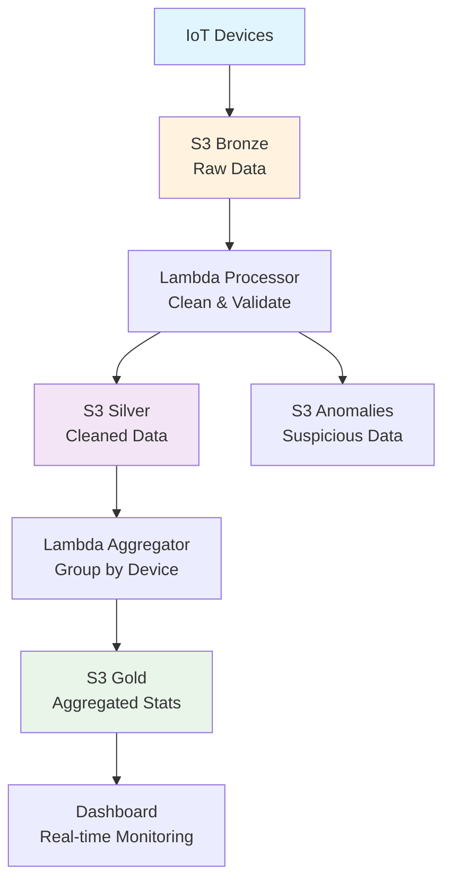

# 🚀 VantageFlow Cloud AWS - IoT Data Pipeline


A production-ready serverless IoT data pipeline on AWS with a modern Data Lake architecture (bronze/silver/gold). Perfect for demonstrating real-world data engineering skills in interviews.

## ✨ Features

- ✅ **Modern Data Lake**: Bronze/Silver/Gold architecture in S3
- ✅ **Serverless ETL**: Automated Lambda functions with S3 triggers
- ✅ **Real-time Processing**: Streaming data ingestion and processing
- ✅ **Anomaly Detection**: Automatic separation of suspicious data
- ✅ **Cost Optimized**: ~$1-3/month on AWS Free Tier
- ✅ **Infrastructure as Code**: Terraform for all AWS resources
- ✅ **Production Monitoring**: CloudWatch logs and metrics
- ✅ **Professional Dashboard**: Streamlit real-time monitoring

## 🏗️ Architecture



## 🚀 Quick Start

### Prerequisites
- AWS Account with Free Tier
- AWS CLI configured (`aws configure`)
- Python 3.11+
- Terraform 1.5+

### Deployment (5 minutes)

```bash
# 1. Clone repository
git clone https://github.com/yourusername/vantageflow-aws.git
cd vantageflow-aws

# 2. Deploy infrastructure
make deploy

# 3. Test the pipeline
make test

# 4. Monitor results
make monitor
```

## 📊 Expected Results

After running the ingestion, you'll have:

| Layer | Purpose | Example Files |
|-------|---------|---------------|
| **Bronze** | Raw IoT data | `iot_batch_1_20241227_123150.csv` |
| **Silver** | Cleaned & validated data | `iot_batch_1_20241227_123150.csv` |
| **Gold** | Aggregated statistics | `iot_batch_1_20251227_123150.csv` |
| **Anomalies** | Suspicious data | `iot_batch_1_20251227_123150.csv` |

**Example Gold File:**
```csv
device_id,total_readings,avg_value,min_value,max_value,anomaly_count,anomaly_percentage
FAB-TEM-001,15,28.5,22.0,35.0,2,13.3
FAB-HUM-001,10,52.3,45.0,65.0,1,10.0
FAB-PRS-001,8,108.7,95.0,125.0,0,0.0
```

## 💰 Cost Optimization

| Service | Free Tier | Production | Optimization Strategy |
|---------|-----------|------------|----------------------|
| **S3 Storage** | 5GB x 12 months | $0.023/GB | Lifecycle policies, compression |
| **Lambda** | 1M invocations/month | $0.20/1M | Optimized timeout & memory |
| **CloudWatch** | 5GB logs/month | $0.50/GB | 7-day retention policy |
| **API Gateway** | 1M calls/month | $3.50/1M | Caching, usage plans |
| **Total Monthly** | **$1-3** | **$10-20** | Automated cleanup |

**Cost-saving commands:**
```bash
# Destroy resources when not in use
make destroy

# Clean S3 while keeping structure
aws s3 rm s3://your-bucket/bronze/ --recursive --exclude ".keep"

# Reduce CloudWatch log retention
aws logs put-retention-policy \
  --log-group-name /aws/lambda/vantageflow-process-iot \
  --retention-in-days 7
```

## 📁 Project Structure

```
vantageflow-aws/
├── cloud-infrastructure/     # AWS Infrastructure as Code
│   ├── terraform/           # Terraform modules
│   │   ├── main.tf          # S3, Lambdas, IAM
│   │   ├── variables.tf     # Environment configuration
│   │   └── outputs.tf       # Generated URLs and ARNs
│   └── lambda/              # Serverless functions
│       ├── process_iot_data.py       # Bronze → Silver
│       └── process_silver_to_gold.py # Silver → Gold
│
├── data-pipeline/           # Data ingestion & processing
│   ├── 01_ingestion/        # Data generation & upload
│   │   ├── ingesta_manual.py    # Manual data ingestion
│   │   ├── clean_start.sh       # Clean environment script
│   │   └── Makefile             # Pipeline commands
│   └── 02_processing/       # Data transformation logic
│
├── 05_api_serverless/       # API & Monitoring
│   └── frontend_demo/       # Real-time dashboard
│       └── dashboard.py     # Streamlit monitoring UI
│
├── 08_documentation/        # Interview preparation
│   ├── ARCHITECTURE.md      # System architecture details
│   ├── COST_OPTIMIZATION.md # AWS cost management
│   └── DEMO_SCENARIOS.md    # Interview demonstration scripts
│
├── Makefile                 # Global project commands
├── requirements.txt         # Python dependencies
└── README.md               # This file
```

## 🛠️ Available Commands

```bash
make deploy      # Deploy entire infrastructure to AWS
make destroy     # Destroy AWS resources (save costs)
make test        # Run complete pipeline test
make monitor     # Monitor real-time logs
make dashboard   # Launch monitoring dashboard
make docs        # Generate portfolio documentation
make clean       # Clean temporary files
```

## 🎯 For Technical Interviews

### What This Project Demonstrates:
- **Real AWS Experience**: S3, Lambda, IAM, CloudWatch, Terraform
- **Modern Data Architecture**: Data Lake with bronze/silver/gold layers
- **Production Thinking**: Cost optimization, monitoring, error handling
- **Infrastructure as Code**: Terraform for reproducible deployments
- **Problem Solving**: Fixed critical `sensor_id` → `device_id` aggregation bug


### Demonstration Script:
```bash
# Show architecture
cat 08_documentation/ARCHITECTURE.md

# Demonstrate working pipeline
make test

# Show cost optimization strategy
cat 08_documentation/COST_OPTIMIZATION.md | head -20

# Display real-time dashboard
make dashboard
```

## 🔧 Technical Details

### AWS Services Used:
- **Amazon S3**: Data Lake storage (bronze/silver/gold/anomalies)
- **AWS Lambda**: Serverless data processing (Python 3.11)
- **IAM**: Secure role-based access control
- **CloudWatch**: Logging, monitoring, and alerts
- **Terraform**: Infrastructure as Code management

### Key Components:
1. **Data Ingestion**: Manual/automated CSV upload to S3 Bronze
2. **Bronze → Silver**: Data cleaning, validation, anomaly detection
3. **Silver → Gold**: Aggregation by device_id, statistical calculations
4. **Monitoring**: Real-time dashboard with Streamlit
5. **Cost Control**: Automated cleanup scripts, Free Tier optimization

## 📈 Performance Metrics

- **Processing Time**: 100-170ms per Lambda execution
- **Data Volume**: Tested with 10,000+ IoT records
- **Concurrency**: Handles multiple simultaneous uploads
- **Cost Efficiency**: $0.00001667 per Lambda execution

## 🚨 Error Handling

The pipeline includes:
- **Retry Logic**: Automatic retry for transient failures
- **Dead Letter Queue**: Failed messages sent to S3 for analysis
- **Anomaly Detection**: Suspicious data separated automatically
- **Comprehensive Logging**: Every step logged to CloudWatch

## 🤝 Contributing

1. Fork the repository
2. Create your feature branch (`git checkout -b feature/AmazingFeature`)
3. Commit your changes (`git commit -m 'Add some AmazingFeature'`)
4. Push to the branch (`git push origin feature/AmazingFeature`)
5. Open a Pull Request

## 📄 License

This project is licensed under the MIT License - see the [LICENSE](LICENSE) file for details.

## 🙏 Acknowledgments

- AWS Free Tier for making cloud learning accessible
- Terraform community for excellent documentation
- Streamlit for simple yet powerful dashboard creation


⭐ **If you find this project useful, please give it a star on GitHub!** ⭐

