#  VantageFlow Cloud AWS - IoT Data Pipeline


A production-ready serverless IoT data pipeline on AWS. Modern Data Lake architecture with real-time processing and monitoring dashboard.

## 📊 Data Flow

```mermaid
flowchart TD
    A[IoT Devices] --> B[S3 Bronze<br/>Raw CSV Data]
    B --> C[Lambda Processor<br/>Clean & Validate]
    C --> D[S3 Silver<br/>Cleaned Data]
    C --> E[S3 Anomalies<br/>Suspicious Data]
    D --> F[Lambda Aggregator<br/>Group by Device]
    F --> G[S3 Gold<br/>Aggregated Stats]
    G --> H[📊 Streamlit Dashboard]
    G --> I[Power BI / Tableau]
```



## 🚀 Quick Start

```bash
# Clone & deploy
git clone https://github.com/yourusername/vantageflow-aws.git
cd vantageflow-aws

# Deploy infrastructure
make deploy

# Test pipeline
make test

# Launch dashboard
make dashboard
```

## 🏗️ Architecture

### **Data Layers**
| Layer | Purpose | Format |
|-------|---------|---------|
| **Bronze** | Raw IoT data | CSV files |
| **Silver** | Cleaned & validated | CSV files |
| **Gold** | Aggregated statistics | CSV files |
| **Anomalies** | Suspicious data | CSV files |

### **AWS Services**
- **Amazon S3** - Data Lake storage
- **AWS Lambda** - Serverless processing
- **CloudWatch** - Monitoring & metrics
- **IAM** - Security & permissions
- **Terraform** - Infrastructure as Code

## 📈 Sample Output

**Gold Layer Data:**
```csv
device_id,total_readings,avg_value,anomaly_percentage
DEV-001,150,28.5,12.3
DEV-002,230,45.2,8.7
DEV-003,89,32.1,25.4
```

## 💰 Cost Optimization

| Service | Free Tier | Production | Strategy |
|---------|-----------|------------|----------|
| S3 Storage | 5GB × 12 months | $0.023/GB | Lifecycle policies |
| Lambda | 1M invocations/month | $0.20/1M | Optimized timeout |
| CloudWatch | 5GB logs/month | $0.50/GB | 7-day retention |
| **Total** | **$1-3/month** | **$10-20/month** | 85% savings |

## 📁 Project Structure

```
vantageflow-aws/
├── cloud-infrastructure/  # AWS Infrastructure
│   ├── terraform/        # Terraform configs
│   └── lambda/           # Lambda functions
├── data-pipeline/        # ETL scripts
├── dashboard/            # Streamlit UI
├── documentation/        # Architecture & guides
├── Makefile             # Project commands
└── README.md           # This file
```

## 🛠️ Commands

```bash
make deploy    # Deploy to AWS
make destroy   # Remove resources
make test      # Test pipeline
make monitor   # View logs
make dashboard # Launch UI
make clean     # Clean up
```

## 🔧 Tech Stack

- **AWS**: S3, Lambda, CloudWatch, IAM
- **Languages**: Python 3.11
- **IaC**: Terraform
- **Dashboard**: Streamlit, Plotly
- **CI/CD**: GitHub Actions

## 📊 Metrics & Monitoring

**CloudWatch Metrics:**
- `RowsProcessed` - Total records
- `AnomalyPercentage` - Anomaly rate
- `ProcessingTime` - Execution speed
- `DevicesProcessed` - Unique devices

**Real-time Dashboard:**
- Live pipeline status
- Data visualization
- Device analytics
- Cost monitoring

## 🎯 Use Cases

- **IoT Data Processing** - Real-time sensor data
- **Data Quality** - Anomaly detection & cleaning
- **Business Intelligence** - Ready for BI tools
- **Portfolio Project** - AWS skills demonstration
- **Interview Prep** - Technical showcase

## 📄 License

MIT License - see [LICENSE](LICENSE) file.

---

<div align="center">

**⭐ If you find this useful, please give it a star!**

**Built with ❤️ by [Your Name](https://github.com/yourusername)**

</div>